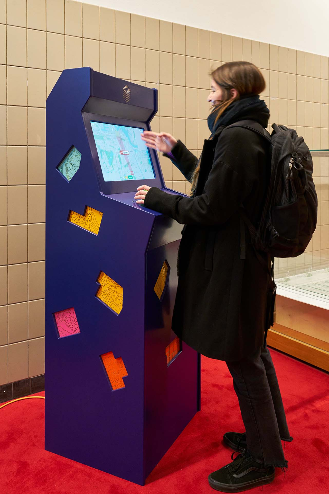
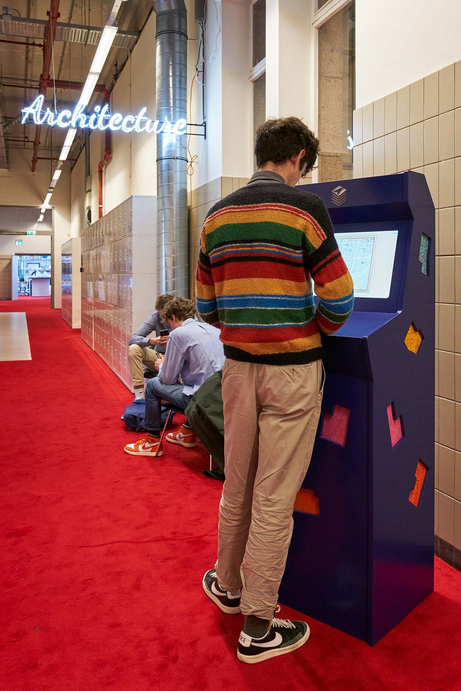
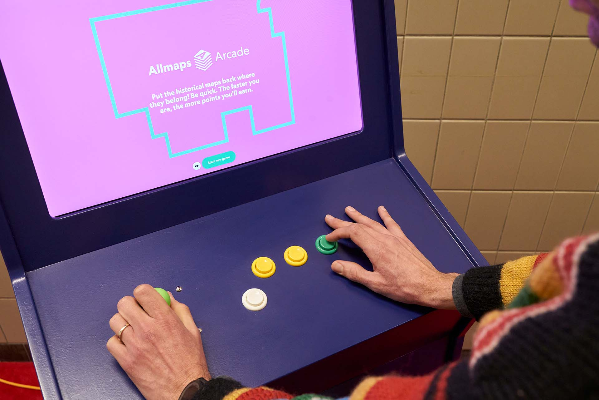

# Allmaps Arcade 🕹

**Put the historical maps back where they belong! Be quick. The faster you are, the more points you'll earn.**

Play Allmaps Arcade on https://arcade.allmaps.org. 🕹🎮

## About

Allmaps Arcade is a game made by <a href="https://bertspaan.nl">Bert Spaan</a>.
The development of the initial version was commissioned by the [Delft University of Technology Library](https://heritage.tudelft.nl/).

The game is part of <a href="https://allmaps.org">Allmaps</a>, an open source project for
curating, georeferencing and exploring IIIF maps.

Credits:

- Concept & design: [Luuk van de Ven](https://luukvandeven.nl), [Bert Spaan](https://bertspaan.nl) and [Jules Schoonman](https://www.tudelft.nl/en/staff/j.a.schoonman)
- Background map data © [OpenStreetMap](https://www.openstreetmap.org/about/). [Protomaps](https://protomaps.com/) is used to host, style and render the background
  map.
- Built with [SvelteKit](https://kit.svelte.dev/), [MapLibre](https://maplibre.org/) and [XState](https://xstate.js.org/).
- Georeferenced maps come from the collections of [partner institutions](https://allmaps.org/#partners) of the Allmaps project as well as from other libraries, archives and museums with [IIIF map collections](https://github.com/allmaps/iiif-map-collections).

## Arcade cabinet

  
  

## Roadmap

We're working on adding the following features to Allmaps Arcade:

- Highscores list
- Show metadata about map (title, description) as well as links to the holding institution
- Share results, generate image after each game that you can share, with score and links to maps.
- Publish instructions how to build cabinet on GitHub
- Add easy/medium/hard difficulty levels

## Running locally

Install dependencies:

    pnpm install

Run development server:

    pnpm run dev

## Cabinet version

The cabinet version of Allmaps Arcade is designed to run offline. If an internet connection is available at startup, it builds the latest version of Allmaps Arcade from GitHub and downloads new maps. The computer in the cabinet runs a web server that serves the following files:

- A Protomaps `pmtiles` files of the whole world.
- A copy of the Georeference Annotations listed in [`config.yaml`](static/config.yaml).
- A copy of the IIIF image tiles of each image specified in the Georeference Annotations.

### Joystick and buttons

The Allmaps Arcade cabinet uses the [I-PAC2 USB interface](https://www.ultimarc.com/control-interfaces/i-pacs/i-pac2/) the joystick and buttons to keyboard keys.

The following pins and keys are used:

| Pin    | Key |
| :----- | :-- |
| 1 SW 5 | Z   |
| 1 SW 6 | X   |
| 1 SW 7 | C   |
| 1 SW 8 | V   |
